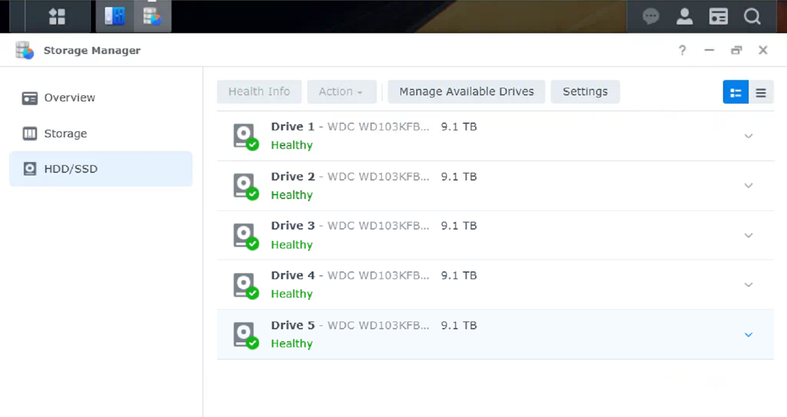

On-site SMART verification completed.

Actions:
- Accessed Storage Manager > HDD/SSD
- Verified all installed drives detected
- SMART status Normal for all disks

Evidence:

### Evidence

Screenshot captured prior to RAID and volume creation.
