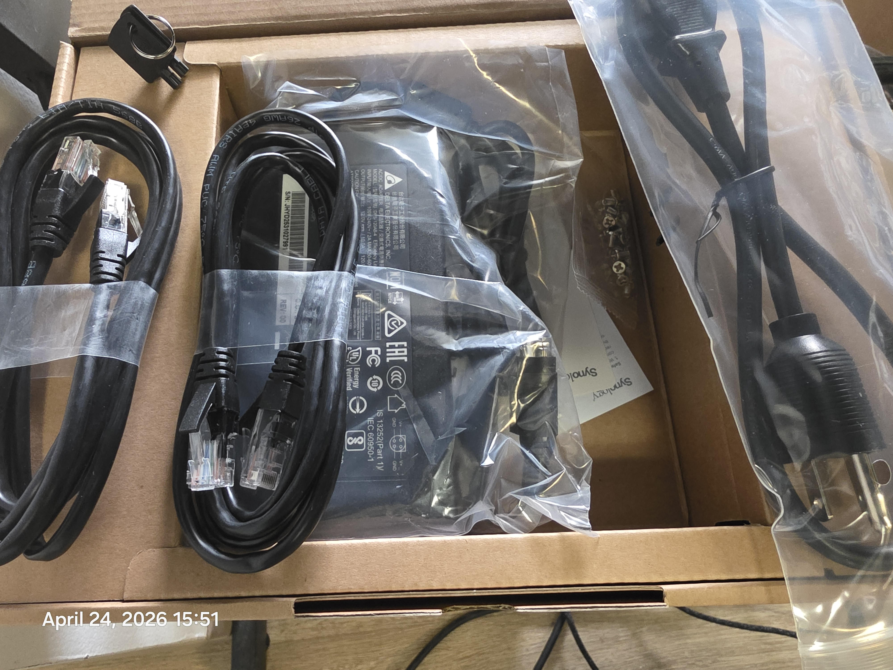
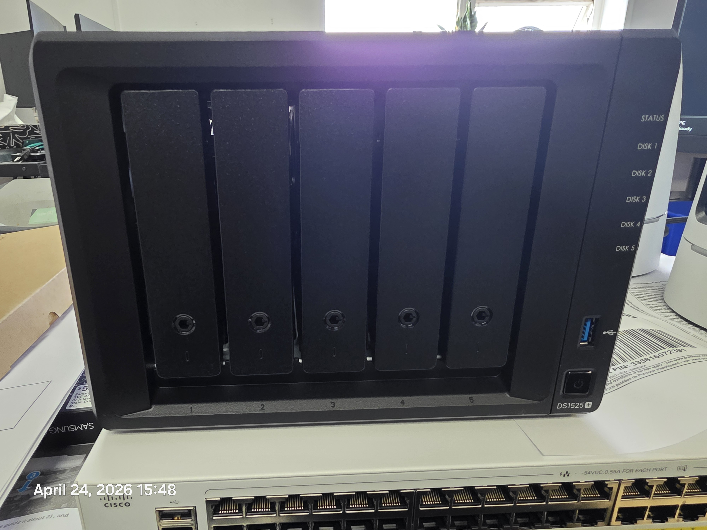
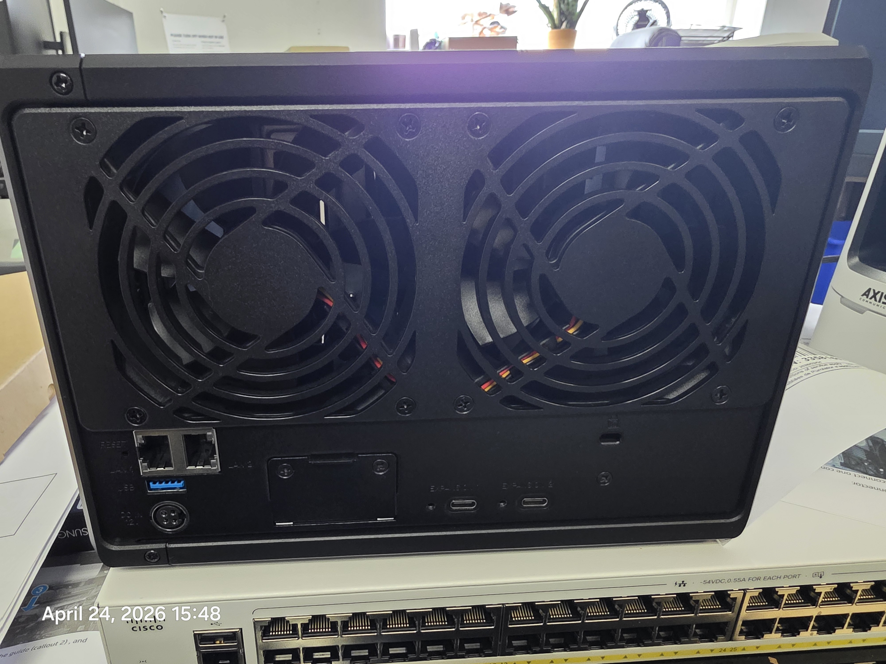

## Baseline Verification – Multi‑Phase Evidence

This folder contains baseline system verification evidence collected
across multiple provisioning phases, including unboxing, disk health
verification, and volume initialization.

## Evidence

### Box Contents

### NAS Front

### NAS Rear

